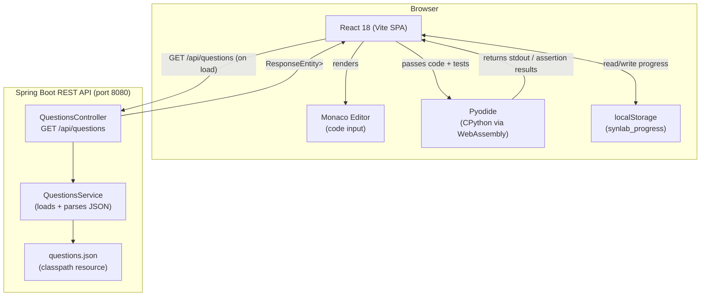

# SynLab — Architecture

## 1. Bird's-Eye View

SynLab is a single-page learning environment where beginners write and run Python exercises entirely inside the browser. There is no server-side code execution — no sandbox, no container, no subprocess. Python runs via Pyodide, a WebAssembly build of CPython that ships directly to the browser. This is the central architectural fact that everything else is built around.

The backend is intentionally thin: it serves questions from a JSON file over a REST API and does nothing else. It holds no user data, runs no user code, and has no write endpoints today. The split is deliberate — the browser owns execution, the server owns content.

**The Pyodide constraint is absolute.** The backend must never receive, evaluate, or execute user-submitted code under any circumstances, regardless of future feature requests.

---

## 2. Component Diagram



The browser never sends code to the server. The only traffic between client and server is the initial question fetch. Everything after that — editing, running, checking tests, tracking progress — is local.

---

## 3. Directory Structure

### Frontend (`frontend/src/`)

```
components/    — Reusable UI pieces: the editor pane, question list, feedback display, theme toggle
hooks/         — Data-fetching and stateful logic extracted from components (e.g. useQuestions)
pages/         — Top-level route components; MainPage.jsx is currently the only page
utils/         — Pure functions with no React dependencies: test runners, output formatters
context/       — React context providers for cross-cutting state (e.g. theme mode)
```

### Backend (`backend/src/main/java/com/synlab/backend/`)

```
controller/    — Thin HTTP handlers; one controller per resource, no business logic inside
service/       — All business logic lives here; currently: reading and deserializing questions.json
model/         — Java records used as DTOs and API response shapes (Question, ErrorResponse)
config/        — Spring beans for CORS, ObjectMapper, and other infrastructure wiring
exception/     — GlobalExceptionHandler (@ControllerAdvice) maps exceptions to ErrorResponse JSON
```

The `repository/` package does not exist yet — it is added only when PostgreSQL is introduced.

---

## 4. Key Architecture Decisions

### Pyodide for Python execution, not a server-side sandbox

The obvious alternative to Pyodide is a server-side execution sandbox — a container or subprocess that runs Python and streams output back. Server sandboxes are operationally expensive: they require container isolation, resource limits, timeout enforcement, network egress blocking, and a job queue to prevent abuse. They also introduce latency on every Run click and create a meaningful attack surface.

Pyodide moves all of this burden into the browser's own security model. WebAssembly runs in a hardened sandbox by design. The browser's same-origin policy and memory isolation are already there. There is no server to abuse, no queue to exhaust, and no latency from a network round-trip. For a learning tool running short beginner exercises, Pyodide's startup cost (loading the Wasm binary on first use) is an acceptable trade-off.

The main thing Pyodide cannot do is access the filesystem or make arbitrary network requests — which is exactly the constraint a learning sandbox needs.

### JSON file for question storage, not PostgreSQL

PostgreSQL is the right long-term answer, but it introduces operational overhead that isn't justified until there is user-generated content or a need to edit questions without a deployment. Right now, questions change infrequently, are authored by developers, and ship with the application. A classpath JSON file is the simplest data store that works.

The seam for the migration is clean: `QuestionsService` is the only class that touches the file. Swapping it for a JPA repository changes one class, leaves `QuestionsController` untouched, and requires no API contract changes.

### localStorage for progress, not a database

User accounts require auth infrastructure — sessions, tokens, password resets, email verification — none of which serves the core learning goal today. localStorage gives each user a private, zero-friction progress store that works offline and requires no sign-up friction for a new learner evaluating the tool.

The cost is obvious: progress is device-specific and not recoverable. That trade-off is acceptable for the current audience. The migration path is equally clean: components that display or update progress already accept an optional `user` prop, so the hook that reads localStorage can be swapped for an API call without touching component signatures.

### React + Vite, not Next.js

SynLab is a single-page application with no server-rendered routes, no SEO requirements for individual question pages, and no need for API routes in the frontend layer. Next.js solves problems this app does not have and would add build complexity and deployment coupling (Node.js server or edge runtime). Vite gives fast HMR in development and produces a static build artifact that can be deployed anywhere — a CDN, Vercel's static hosting, or an S3 bucket.

### Spring Boot, not Node.js

The backend is a thin content API. Spring Boot gives a well-understood operational model, strong typing through Java records, and a mature ecosystem for the PostgreSQL migration that is coming. The backend will eventually own user accounts, progress sync, and potentially exercise validation — workloads where the Java ecosystem (JPA, Spring Security, Flyway) has strong existing patterns.

### Monaco Editor, not CodeMirror

Monaco is the editor engine behind VS Code. For learners who will eventually use a professional IDE, Monaco provides the closest possible preview of that experience — same keybindings, same syntax highlighting model, same autocomplete behavior. CodeMirror is lighter and more embeddable, but the marginal bundle size of Monaco is worth the familiarity benefit for the target audience.

### Official Railway CLI container for CI/CD, not `bervProject/railway-deploy`

The GitHub Actions backend deploy step uses Railway's official CLI Docker container (`ghcr.io/railwayapp/cli:latest`) rather than the community `bervProject/railway-deploy` action.

The `bervProject` action was the original choice but was abandoned after repeated failures: it pins Railway CLI at v3.11.4 (hardcoded, never updates), does not work with Railway's current project token format, and is unmaintained. Switching to the official container resolved all token and deployment issues.

The local Maven build step (`./mvnw clean package`) was also removed from the CI pipeline as a result. `railway up` uploads source code to Railway, which then builds the Docker image on its own infrastructure using the `backend/Dockerfile`. Building the JAR locally in CI was redundant work — Railway was rebuilding it anyway via the Dockerfile.

---

## 5. Data Flow

### App load — fetching and rendering questions

When the React app boots, `useQuestions` fires a single `GET /api/questions` request to the Spring Boot API. The controller delegates immediately to `QuestionsService`, which reads `questions.json` from the classpath, deserializes it into a `List<Question>`, and returns it as a `ResponseEntity`. The response is a flat JSON array; grouping by topic happens on the frontend after the data arrives.

React receives the array, groups questions by their `group` field, sorts within each group by `order`, and renders the question list in the left panel. The first question is selected by default. No subsequent network requests are made during normal use.

If the fetch fails, `GlobalExceptionHandler` returns a structured `ErrorResponse` JSON with `status`, `message`, and `timestamp`. The `useQuestions` hook captures the error in its own error state and the UI renders an error message. Separately, the `ErrorBoundary` component catches unexpected React render errors and shows a fallback UI — these are two distinct error-handling layers.

### Code execution — what happens when the user clicks Run

Run is a purely client-side operation. When the user clicks Run:

1. The Monaco Editor exposes the current editor content as a string.
2. The frontend appends the question's `tests` array (Python assert statements) to the user's code.
3. The combined string is passed to Pyodide's `runPythonAsync` method.
4. Pyodide executes the code inside the WebAssembly sandbox. stdout is captured via Pyodide's `sys.stdout` redirection.
5. If all asserts pass, the question is marked complete: `synlab_progress` in localStorage is updated with `{ [questionId]: true }`.
6. The feedback panel renders the output — pass confirmation, assertion errors, or exception tracebacks.

No code string ever leaves the browser. The backend receives no Run event, no code payload, and no result.

---

## 6. Constraints and Non-Goals

These are hard invariants. Violating them requires an explicit architectural decision, not a quick fix:

**The backend never executes user code.** Not in a subprocess, not via a library, not via reflection. If a future feature request would require the server to evaluate Python, that request changes the security model and must be treated as a new architectural decision.

**SynLab is a single-page application.** There are no server-rendered pages, no dynamic routes served by the backend, and no frontend routing beyond the single main page today. Adding new pages means adding React Router routes, not backend views.

**There is no authentication today.** No endpoints are protected, no sessions exist, and no user identity is assumed. Features that require identity — leaderboards, progress sync, custom exercises — are explicitly out of scope until auth infrastructure is added.

**`questions.json` is the source of truth for question content.** No question data is stored in a database yet. The admin workflow for adding or editing questions is: edit the JSON file, redeploy. This is intentional and is not a bug.

**The question list is non-destructive.** Users can open any question in any order. There are no locked questions, no prerequisite gates, and no time limits. The `order` field is a recommendation, not enforcement.

---

## 7. Future Roadmap Hooks

The codebase is structured to keep these migrations cheap.

**JSON to PostgreSQL.** The migration touches exactly one class: `QuestionsService`. Replace the file-reading logic with a JPA repository call. `QuestionsController` never changes — its signature is `ResponseEntity<List<Question>>` regardless of where the data comes from. Add the `repository/` package, introduce a JPA entity and a Flyway migration, and the rest of the app is unaware of the change.

**localStorage to user accounts.** Components that render or mutate progress already accept an optional `user` prop. The hook that reads from `synlab_progress` in localStorage can be extended to check whether a `user` is present and, if so, fetch progress from an API endpoint instead. The UI layer requires no changes. Auth itself (Spring Security + JWT or session cookies) is additive infrastructure — it does not touch the questions API or the execution model.

**Client-side execution stays client-side after auth.** Adding user accounts does not change where Python runs. Pyodide remains the execution engine even after auth is introduced. Server-side execution is not a planned migration path — it would require a separate architectural decision and is not a natural next step on the roadmap.

**Additional question groups and formats.** The `group` and `order` fields in `questions.json` already support arbitrary topic organization. New groups appear automatically in the UI without any code changes. If question formats expand (e.g., multiple-choice, fill-in-the-blank), the `tests` field mechanism generalizes: the field type changes from `string[]` of assert statements to a discriminated union, which requires a model change in Java and a renderer change in React — but no changes to the delivery or execution pipeline.
